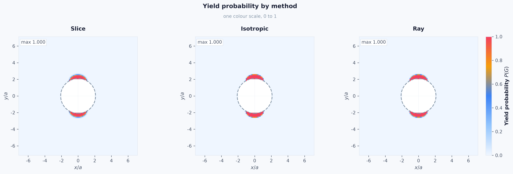
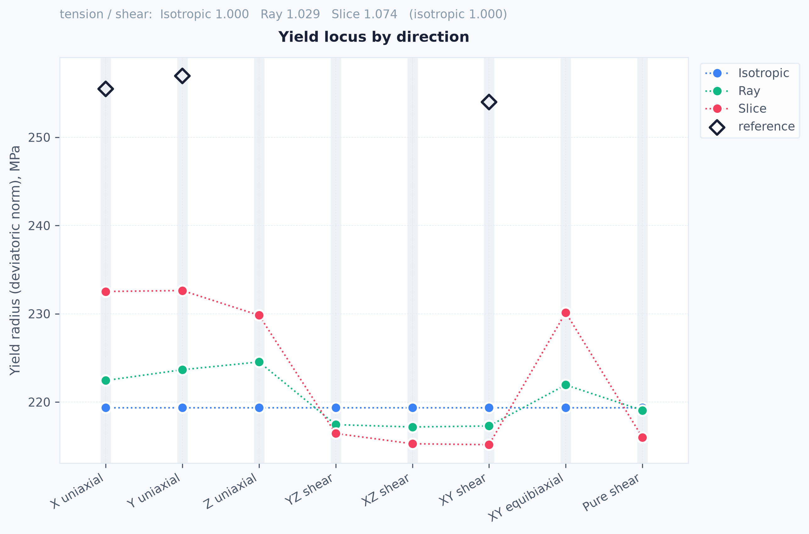

# matviz3d-yield

> GitHub repository: **`matviz3d-yield`** · import package: **`mvyield`** · CLI: **`mvy`**

Data-driven yield probability from polycrystalline microstructure datasets
generated with **[MatViz3D](https://github.com/MME-NTU-KhPI/MatViz3D)**, the
microstructure generator/solver developed at the Department of Materials
Mechanics, NTU "Kharkiv Polytechnic Institute".

Given a cloud of yield points extracted from a MatViz3D dataset, the package
builds a probabilistic yield surface in deviatoric stress space and evaluates
the probability of yielding, `P(G)`, at every point of a stress field — an
analytical Kirsch solution or a field exported from ANSYS.

Two inputs define a run:

1. **A dataset** — which is also the material definition. Crystal structure,
   CRSS and the rest were fixed when it was generated, and are read back from
   the HDF5 file rather than restated in a config.
2. **A stress field** — analytical (Kirsch plate with a hole) or imported
   from ANSYS.

Everything between them — deviatoric mapping, density estimation, probability,
figures — is shared, which is what lets a new problem be a config file rather
than new code.



*Yield probability `P(G)` around a hole in a Kirsch plate (BCC dataset,
remote tension 150 MPa), evaluated by the three estimators on one colour
scale.*

## Install

Requires Python ≥ 3.11.

```bash
git clone https://github.com/MME-NTU-KhPI/matviz3d-yield.git
cd matviz3d-yield

pip install -e ".[dev]"          # core + tests
pip install -e ".[ingest]"       # + dataset analysis (h5py, pandas)
pip install -e ".[vtk,pinn]"     # + ParaView export, neural surface
```

Optional extras are separate on purpose: evaluating an existing model on a new
field pulls in neither `h5py` nor `torch`.

## Data

Datasets are **not** part of the repository (a single file is 150–900 MB).
A case file points at an HDF5 dataset in the MatViz3D layout, by default under
`data/datasets/`:

```yaml
dataset:
  source: data/datasets/synth_abl_stress.hdf5
```

Relative paths resolve against the repository root first and then against the
data root, so datasets can live anywhere by setting one environment variable:

```bash
export MVY_DATA_DIR=/path/to/datasets     # Windows: set MVY_DATA_DIR=D:\datasets
```

`mvy doctor --case <case>` reports whether the inputs are found before a long
run starts.

## Three modes

```bash
mvy doctor --case configs/cases/kirsch_bcc.yaml   # check inputs before a long run

mvy ingest      --case configs/cases/kirsch_bcc.yaml   # A: dataset analysis only
mvy build-model --case configs/cases/kirsch_bcc.yaml   #    fit the yield model
mvy calibrate   --case configs/cases/kirsch_bcc.yaml --refine --verify
mvy run         --case configs/cases/kirsch_bcc.yaml   # B: yield probability only
mvy all         --case configs/cases/kirsch_bcc.yaml   # C: everything in one pass
```

* **Mode A** (`ingest`) reads only the `dataset` section, extracts the yield
  points and writes `models/<hash>.yieldpoints.npz` plus diagnostic figures
  (pair plots, projected KDE, stress/strain space, histograms, eigenvalue
  tracking, Schmid factors).
* **Mode B** (`run`) takes the model named by the case, builds the stress
  field, evaluates every requested method and draws the figures. If the model
  file is missing the command stops with a hint rather than silently falling
  back to a cruder estimate.
* **Mode C** (`all`) chains ingest → build-model → run into one run directory
  with a shared `run.log`. `--force` redoes every step even if the artefacts
  are fresh.

Every command takes `--dry-run` (show the resolved config and the planned
steps, compute nothing) and `--set key.path=value`:

```bash
mvy run --case configs/cases/kirsch_bcc.yaml --dry-run \
        --set 'model.methods=[kde_slice]' --set model.primary=kde_slice
```

Other commands:

```bash
mvy plot runs/<run_dir> --plots diagnostics --format svg   # redraw without recomputing
mvy show-model models/<name>.model.npz                     # inspect a model bundle
mvy init-case my_case --from ansys                         # starter case config
mvy plot --list                                            # registered figures
```

## Methods

| Name        | What it does                                                                 |
|-------------|------------------------------------------------------------------------------|
| `analytic`  | Gaussian in von Mises radius, mean and std estimated from the yield cloud    |
| `kde_ray`   | Direction-localised KDE of the yield radius along the query ray              |
| `kde_slice` | KDE on a polar slice through the cloud, with an effective-sample-size guard  |

When two or more methods run, `compare` reports where they agree, the
tension/shear anisotropy against `compare.reference_locus`, and the decision
agreement at `compare.p_crit`.



*Yield radius (deviatoric norm) along eight loading directions. The isotropic
Gaussian is a flat line by construction; the ray and slice estimators resolve
the tension/shear anisotropy of the dataset. Diamonds are the reference values
from `compare.reference_locus`, converted to the same metric.*

## Outputs

Each run gets its own timestamped directory, so a previous result is never
overwritten:

```
runs/2026-09-05_0027_run_kirsch_bcc/
├── config.resolved.yaml    # the merged configuration that produced this run
├── run.log
├── summary.md              # human-readable report
├── data/results.npz        # arrays: field, P(G) per method, coverage, eff_n
└── plots/*.png, *.svg
```

Model bundles are shared across runs and live in `models/`, keyed by a hash of
the dataset and model settings:

```
models/<hash>.yieldpoints.npz   # extracted yield points (mode A)
models/<hash>.model.npz         # fitted model with calibrated hyper-parameters
models/<hash>.steps.npz         # per-step dataset analysis
```

`runs/`, `models/` and `data/` are ignored by git.

## A new problem

Copy a case file from `configs/cases/`. A different material means a different
`dataset.source` and nothing else. A different problem means a different
`field` section — `wire_ansys.yaml` is the same dataset with an ANSYS export
in place of the analytical solution, plus a `view.reductions` block that cuts
the 3D field into 2D figures.

## Conventions

Configs state **intent**; artefacts record **fact**. No command writes back to
a config file, so a case always says what was asked for. Resolved material
properties, calibrated hyper-parameters and the space transform live in the
model bundle, with provenance:

```bash
mvy show-model models/<name>.model.npz
```

Stress vectors carry an explicit Voigt/Mandel convention
(`mandel_xy_last` by default); the ANSYS adapter applies the Mandel factor
exactly once, on the way in. Code, comments and figure labels are English.
Console output and `summary.md` follow `report.lang` (`en` or `uk`).

## Tests

```bash
pytest              # ~350 tests, a few minutes
pytest -m slow      # full pass over a real dataset, if one is available
```

The generated datasets carry reference yield points, and dataset analysis
reproduces them step by step to floating-point agreement — which is the check
that the whole chain from HDF5 to model is right, not merely plausible. The
estimators are also checked against a verbatim copy of the pre-refactor code
(`tests/legacy_reference.py`) to machine precision.

## Project layout

```
src/mvyield/
├── cli.py          # the mvy command
├── settings.py     # config schema, defaults merge, --set overrides
├── paths.py        # repository root, data root, run directories
├── mechanics/      # Voigt/Mandel conventions, stress fields
├── ingest/         # HDF5 reader, material provenance, slip systems, analysis
├── model/          # estimators, calibration, deviatoric transform, bundles
├── cases/          # Kirsch and ANSYS field builders
├── pipeline/       # ingest, build, evaluate, compare, report, replot
└── viz/            # theme, labels, plot registry, figure renderers
configs/
├── defaults.yaml   # every key with its default value
└── cases/          # kirsch_bcc.yaml, wire_ansys.yaml
tests/
```

## License

MIT.
